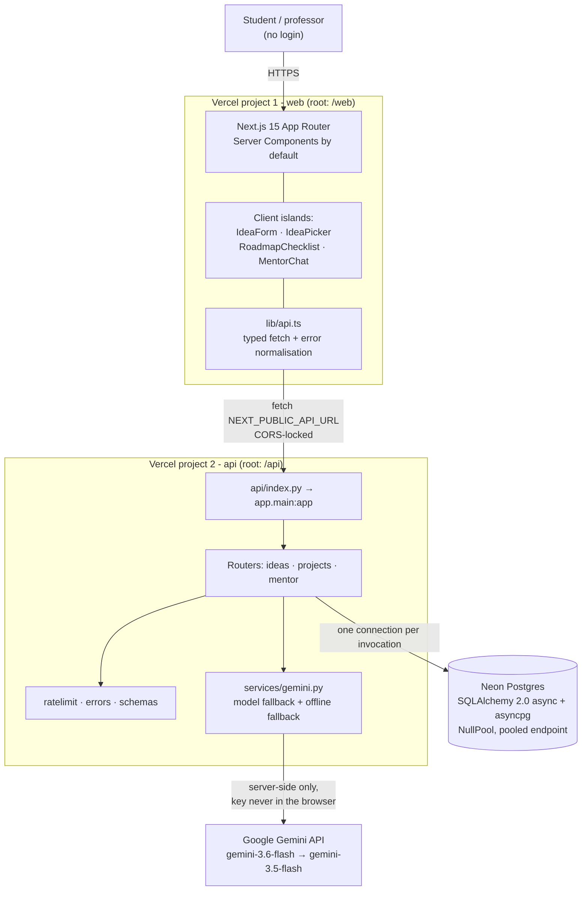

# IdeaForge

**AI-powered project generator and mentor for final-year students.**

A student types what they're interested in and what they can already build with.
IdeaForge returns three scoped project ideas with feasibility scores, turns the
chosen one into a phased roadmap they tick off, and gives them an AI mentor that
knows that exact project — its title, stack, roadmap, and what's already done.

## Live

| | URL |
| --- | --- |
| **Web** | https://promptwars-web.vercel.app |
| **Demo project** (pre-seeded, opens instantly) | https://promptwars-web.vercel.app/projects/demo-project-2026 |
| **Demo idea set** | https://promptwars-web.vercel.app/ideas/demo-ideas-2026 |
| All projects | https://promptwars-web.vercel.app/projects |
| API | https://promptwars-api.vercel.app |
| API docs (OpenAPI) | https://promptwars-api.vercel.app/docs |

> **Problem statement.** *AI Project Idea Generator & Mentor for Final-Year
> Projects — build an AI-powered platform that helps final-year students
> generate project ideas based on their interests and skills, and provides
> guidance on features, technologies, development steps, and improvements to
> turn the idea into a practical project.*

---

## How each requirement is satisfied

| Requirement | Where it lives | What it does |
| --- | --- | --- |
| **Generate ideas from interests and skills** | [`api/app/routers/ideas.py`](api/app/routers/ideas.py) · `POST /ideas` | Sends interests + skills to Gemini and persists three ideas |
| **…based on the student's own input** | [`api/app/services/gemini.py`](api/app/services/gemini.py) `generate_ideas` | Prompt requires the stack to build on skills already held |
| **Guidance on features** | [`api/app/models.py`](api/app/models.py) `Idea.summary`, `Idea.problem_solved` | Each idea states what it does and the problem it solves |
| **Guidance on technologies** | `Idea.tech_stack`, `Project.tech_stack` | Suggested stack per idea, shown on the picker and project page |
| **Guidance on development steps** | [`api/app/routers/projects.py`](api/app/routers/projects.py) `POST /projects` | Gemini returns a phased roadmap stored as `RoadmapStep` rows |
| **Turn the idea into a practical project** | [`web/components/RoadmapChecklist.tsx`](web/components/RoadmapChecklist.tsx) · `PATCH /projects/{id}/steps/{id}` | Student ticks steps off; progress persists to the project URL |
| **Guidance on improvements** | [`api/app/routers/mentor.py`](api/app/routers/mentor.py) `POST /projects/{id}/mentor` | Mentor answers grounded in title, stack, roadmap and completed steps |
| **Feasibility scoring** | `Idea.feasibility` + [`web/components/IdeaPicker.tsx`](web/components/IdeaPicker.tsx) | 1–10 score, shown as a number *and* a word, never colour alone |
| **Shareable without login** | `Project.id` via `new_id()` in [`api/app/models.py`](api/app/models.py) | Random URL-safe token primary keys — public but not enumerable |
| **Google service, visibly used** | `GeminiBadge` beside both AI actions | "Powered by Gemini" on idea generation and on mentor answers |

### Google Gemini — the two visible features

1. **AI Project Generator** — `POST /ideas` produces the three ideas on the picker screen.
2. **Gemini Project Mentor** — `POST /projects/{id}/mentor` answers follow-ups using
   the project's title, skills, stack, roadmap and tick-state as context
   ([`build_context`](api/app/routers/mentor.py)).

Both are server-side only. The key never reaches the browser.

---

## Architecture



**Data model.** `IdeaSet` →< `Idea` (one generation, three ideas). Choosing one
creates a `Project`, which owns `RoadmapStep` and `MentorMessage`. Every foreign
key is indexed, and every `WHERE … ORDER BY` pair has a composite index.

Three decisions worth calling out:

- **Random token primary keys.** Project URLs are shared without auth, so
  sequential ids would let anyone read every student's project by counting.
- **`Project` copies the idea's fields** rather than joining to it — the shared
  URL is the product and must render even if the idea set is pruned.
- **`MentorMessage.created_at` is set in Python, not `func.now()`.** Postgres'
  `now()` is *transaction* start time, so a question and its answer written in
  one transaction would share a timestamp and the chat would render out of order.

---

## Setup

Node 20+, Python 3.12, and a Postgres connection string.

```bash
cd api
python3.12 -m venv .venv && source .venv/bin/activate
pip install -r requirements.txt
cp .env.example .env          # fill DATABASE_URL and GOOGLE_API_KEY
python scripts/migrate.py     # create tables
python scripts/seed.py        # demo project at /projects/demo-project-2026
uvicorn app.main:app --reload --port 8000
```

```bash
cd web
npm install
cp .env.example .env.local    # NEXT_PUBLIC_API_URL=http://localhost:8000
npm run dev
```

## Environment variables

### `api/.env`

| Variable | Required | Notes |
| --- | --- | --- |
| `DATABASE_URL` | yes | Paste the provider's string verbatim. Scheme is rewritten to `postgresql+asyncpg://`; `sslmode`, `channel_binding` and `pgbouncer` are stripped and translated. **Use the pooled endpoint** (`-pooler` host, or port 6543). |
| `GOOGLE_API_KEY` | yes for AI | Google AI Studio key. Server-side only. Without it, AI routes return 503 rather than 500. |
| `ALLOWED_ORIGINS` | yes in prod | Comma-separated exact origins. Never `*`. |
| `ENV` | no | `development` / `test` / `preview` / `production`. Outside dev+test, 500s are stripped to a generic message. |
| `GEMINI_MODELS` | no | Comma-separated, tried in order. Default `gemini-3.6-flash,gemini-3.5-flash`. |
| `GEMINI_TIMEOUT_SECONDS` | no | Per-model timeout. Two attempts must fit `vercel.json`'s `maxDuration` of 60. |

### `web/.env.local`

| Variable | Required | Notes |
| --- | --- | --- |
| `NEXT_PUBLIC_API_URL` | yes | API origin, no trailing slash. |

> `NEXT_PUBLIC_*` is compiled into the browser bundle. It holds a public URL and
> nothing else — no key, no connection string, ever.

## Tests

```bash
cd api && source .venv/bin/activate && pytest
```

**43 tests, no infrastructure required** — they run on in-memory SQLite and a
stubbed Gemini, so `pytest` works offline. Every endpoint has at least one
happy-path and one failure-path test, plus tests for the core logic: model
fallback, mentor grounding, offline fallbacks, cascade deletes, and id opacity.

```bash
cd web && npx tsc --noEmit    # strict, zero `any`
cd web && npm run build
```

## Deploying

Two Vercel projects from this one repo, distinguished by root directory. Both
rebuild on `git push` to `main`. Full click-by-click in [DEPLOY.md](DEPLOY.md).

| | promptwars-api | promptwars-web |
| --- | --- | --- |
| Root directory | `api` | `web` |
| Framework preset | Other | Next.js |
| Build / install | defaults | defaults |

## Not building (deliberately)

Auth, admin dashboard, fine-tuned models, payments, and multi-user
collaboration are all out of scope. The project URL *is* the access model:
bookmarkable, shareable, read-only for anyone the student sends it to.
