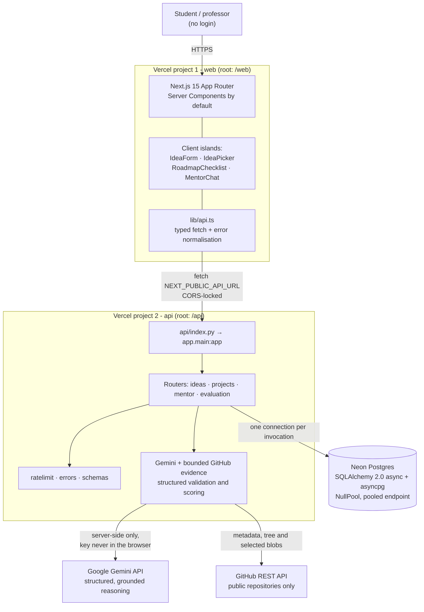

# IdeaForge

**AI-powered project generator and mentor for final-year students.**

A student types what they're interested in and what they can already build with.
IdeaForge returns three scoped project ideas with feasibility scores, turns the
chosen one into a phased roadmap they tick off, and gives them an AI mentor that
knows that exact project — its title, stack, roadmap, and what's already done.
When they have code, IdeaForge compares a bounded set of files from a public
GitHub repository with the frozen scope and produces an evidence-backed
**Planned vs Built** report with the three highest-value fixes.

## Live

| | URL |
| --- | --- |
| **Web** | https://promptwars-web.vercel.app |
| **Demo project** (pre-seeded, opens instantly) | https://promptwars-web.vercel.app/projects/demo-project-2026 |
| **Demo idea set** | https://promptwars-web.vercel.app/ideas/demo-ideas-2026 |
| My projects (private browser-local index) | https://promptwars-web.vercel.app/projects |
| API | https://promptwars-api.vercel.app |
| API docs (OpenAPI) | https://promptwars-api.vercel.app/docs |

> **Problem statement.** *AI Project Idea Generator & Mentor for Final-Year
> Projects — build an AI-powered platform that helps final-year students
> generate project ideas based on their interests and skills, and provides
> guidance on features, technologies, development steps, and improvements to
> turn the idea into a practical project.*

---

## How each requirement is satisfied

| Requirement | Where it lives | What it does |
| --- | --- | --- |
| **Generate ideas from interests and skills** | [`api/app/routers/ideas.py`](api/app/routers/ideas.py) · `POST /ideas` | Sends interests + skills to Gemini and persists three ideas |
| **…based on the student's own input** | [`api/app/services/gemini.py`](api/app/services/gemini.py) `generate_ideas` | Prompt requires the stack to build on skills already held |
| **Guidance on features** | [`api/app/models.py`](api/app/models.py) `core_features`, `stretch_goals` | Each idea has a frozen core scope and clearly optional stretch work |
| **Guidance on technologies** | `Idea.tech_stack`, `Project.tech_stack` | Suggested stack per idea, shown on the picker and project page |
| **Guidance on development steps** | [`api/app/routers/projects.py`](api/app/routers/projects.py) `POST /projects` | Gemini returns a phased roadmap stored as `RoadmapStep` rows |
| **Turn the idea into a practical project** | [`web/components/RoadmapChecklist.tsx`](web/components/RoadmapChecklist.tsx) · `PATCH /projects/{id}/steps/{id}` | Student ticks steps off; progress persists to the project URL |
| **Guidance on improvements** | [`api/app/routers/mentor.py`](api/app/routers/mentor.py) `POST /projects/{id}/mentor` | Mentor answers grounded in title, stack, roadmap and completed steps |
| **Feasibility scoring** | `Idea.feasibility` + [`web/components/IdeaPicker.tsx`](web/components/IdeaPicker.tsx) | 1–10 score, shown as a number *and* a word, never colour alone |
| **Planned vs Built evaluation** | [`api/app/routers/evaluations.py`](api/app/routers/evaluations.py) · `POST /projects/{id}/evaluate` | Compares the frozen plan with commit-pinned evidence from a public GitHub repository |
| **Bounded GitHub inspection** | [`api/app/services/github.py`](api/app/services/github.py) | Reads a capped tree and selected text files; it rejects secret, binary, vendor and oversized input and never executes code |
| **Shareable without login** | `Project.id` + one-time edit capability in [`api/app/project_access.py`](api/app/project_access.py) | Anyone with the random URL can read; only the creating browser can mutate, use the mentor, or trigger evaluation |
| **Google service, visibly used** | `GeminiBadge` beside both AI actions | "Powered by Gemini" on idea generation and on mentor answers |
| **Honest degradation** | [`api/app/services/fallback.py`](api/app/services/fallback.py) + [`web/components/FallbackBanner.tsx`](web/components/FallbackBanner.tsx) | When every model fails, the seeded project is served and the UI says so rather than passing it off as live |
| **Streamed mentor answers** | [`api/app/routers/mentor.py`](api/app/routers/mentor.py) `POST .../mentor/stream` + [`web/lib/stream.ts`](web/lib/stream.ts) | Server-sent events, rendered as sanitized markdown |

### Google Gemini — the three visible features

1. **AI Project Generator** — `POST /ideas` produces the three ideas on the picker screen.
2. **Gemini Project Mentor** — `POST /projects/{id}/mentor` answers follow-ups using
   the project's title, skills, stack, roadmap and tick-state as context
   ([`build_context`](api/app/routers/mentor.py)).
3. **Planned vs Built** — `POST /projects/{id}/evaluate` combines deterministic
   repository signals, selected commit-pinned evidence, and the original scope.
   Every positive feature claim must cite a file that was actually read.

Both are server-side only. The key never reaches the browser.

---

## Architecture



**Data model.** `IdeaSet` →< `Idea` (one generation, three ideas). Choosing one
creates a `Project`, which owns `RoadmapStep`, `MentorMessage`, and immutable
`Evaluation` rows. An evaluation stores repository identity, commit SHA,
evaluator version, score, structured result JSON, and an idempotency constraint.
Every foreign key is indexed, and every `WHERE … ORDER BY` pair has a composite index.

Three decisions worth calling out:

- **Random token primary keys.** Project URLs are shared without auth, so
  sequential ids would let anyone read every student's project by counting.
- **`Project` copies the idea's fields** rather than joining to it — the shared
  URL is the product and must render even if the idea set is pruned.
- **`MentorMessage.created_at` is set in Python, not `func.now()`.** Postgres'
  `now()` is *transaction* start time, so a question and its answer written in
  one transaction would share a timestamp and the chat would render out of order.
- **Read and write capabilities are separate.** The random project URL is a
  public read capability. Creation returns a second 256-bit edit token once;
  only its SHA-256 digest is stored. The token remains in that browser and is
  required for roadmap, mentor, and evaluation calls.

---

## Operational notes

**Gemini free-tier quota is 20 requests per day, per model.** This is the single
biggest demo risk. Two mitigations are built in:

- `GEMINI_MODELS` lists five verified models tried in order. Quota is counted
  per model, so the chain raises the practical ceiling to roughly 100 requests
  per day. Exhausted models return 429 in under a second, so falling through
  them is cheap.
- When the whole chain fails, the seeded example project is served and the UI
  shows a **Fallback mode** banner. The demo degrades; it never dies.

`/projects/demo-project-2026` is pre-seeded and needs no Gemini call at all, so
it always works.

**Repository evaluation is deliberately static and bounded.** It accepts only
canonical `https://github.com/owner/repository` URLs, talks only to the hard-coded
GitHub API origin, rejects private or oversized repositories, caps tree entries,
file count, file size, total bytes and collection time, skips binary/vendor/lock/
secret paths, redacts secret-like values, and pins evidence to one commit.
Repository text is fenced as untrusted data in the Gemini prompt. IdeaForge never
clones, installs, builds, or executes submitted code.

**Timeouts.** Idea generation runs ~6s from Vercel; roadmap generation is
heavier and has exceeded 8s, so the per-model budget is 20s with a 45s ceiling
across the whole chain — inside `vercel.json`'s `maxDuration` of 60. Timeouts
are never retried: a model that ran out of time is slow, not unlucky, and
retrying it spends the budget the next model needs.

**Local development is slower than production.** The Vercel function sits in
`iad1`, beside Google's endpoint; a laptop outside the US sees roughly three
times the latency. Raise `GEMINI_TIMEOUT_SECONDS` in your local `.env`.

---

## Setup

Node 20+, Python 3.12, and a Postgres connection string.

```bash
cd api
python3.12 -m venv .venv && source .venv/bin/activate
pip install -r requirements.txt
cp .env.example .env          # fill DATABASE_URL and GOOGLE_API_KEY
python scripts/migrate.py     # create tables
python scripts/seed.py        # demo project at /projects/demo-project-2026
uvicorn app.main:app --reload --port 8000
```

```bash
cd web
npm install
cp .env.example .env.local    # NEXT_PUBLIC_API_URL=http://localhost:8000
npm run dev
```

## Environment variables

### `api/.env`

| Variable | Required | Notes |
| --- | --- | --- |
| `DATABASE_URL` | yes | Paste the provider's string verbatim. Scheme is rewritten to `postgresql+asyncpg://`; `sslmode`, `channel_binding` and `pgbouncer` are stripped and translated. **Use the pooled endpoint** (`-pooler` host, or port 6543). |
| `GOOGLE_API_KEY` | yes for AI | Google AI Studio key. Server-side only. Without it, AI routes return 503 rather than 500. |
| `GITHUB_TOKEN` | no | Optional server-side token for a higher GitHub API allowance. Public repositories work without it; never expose it to the web app. |
| `ALLOWED_ORIGINS` | yes in prod | Comma-separated exact origins. Never `*`. |
| `ENV` | no | `development` / `test` / `preview` / `production`. Outside dev+test, 500s are stripped to a generic message. |
| `GEMINI_MODELS` | no | Comma-separated, tried in order. Default `gemini-3.6-flash,gemini-3.5-flash`. |
| `GEMINI_TIMEOUT_SECONDS` | no | Per-model timeout. Two attempts must fit `vercel.json`'s `maxDuration` of 60. |

### `web/.env.local`

| Variable | Required | Notes |
| --- | --- | --- |
| `NEXT_PUBLIC_API_URL` | yes | API origin, no trailing slash. |

> `NEXT_PUBLIC_*` is compiled into the browser bundle. It holds a public URL and
> nothing else — no key, no connection string, ever.

## Tests

```bash
cd api && source .venv/bin/activate && ./lint.sh
```

**101+ tests, no infrastructure required** — they run on in-memory SQLite and a
stubbed Gemini, so `pytest` works offline. Every endpoint has a happy-path and a
failure-path test, plus the core logic: model fallthrough, timeouts not being
retried, the overall budget ceiling, prompt building and injection stripping,
response parsing, mentor grounding, owner capabilities, SSE streaming,
route-scoped rate limiting, GitHub URL/size/path/secret boundaries, immutable
evaluation caching, evidence citation enforcement, cascade deletes, and id opacity.

```bash
cd web && npx tsc --noEmit    # strict, zero `any`
cd web && npm run build
```

## Deploying

Two Vercel projects from this one repo, distinguished by root directory. Both
rebuild on `git push` to `main`. Full click-by-click in [DEPLOY.md](DEPLOY.md).

| | promptwars-api | promptwars-web |
| --- | --- | --- |
| Root directory | `api` | `web` |
| Framework preset | Other | Next.js |
| Build / install | defaults | defaults |

## Not building (deliberately)

Accounts, private-repository OAuth, repository cloning/execution, background jobs,
admin dashboards, payments, and multi-user collaboration remain out of scope.
The project URL is a read capability; the creating browser's separate edit
capability protects every mutation and paid AI action.
